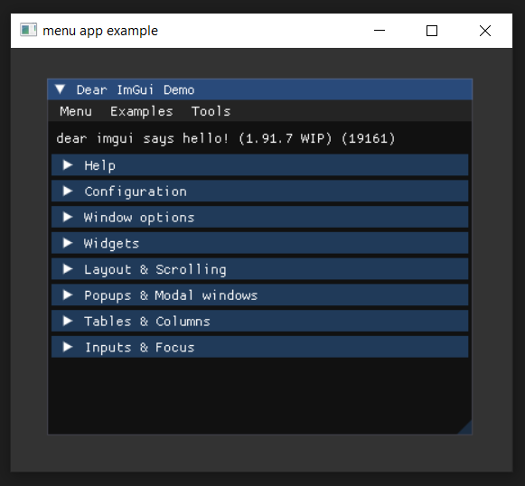
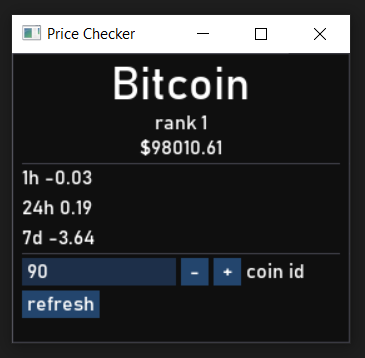

# ender


### About
A 2D rendering framework written in C++.
### Requirements
- Visual Studio 2022 (C++ 20)
- Directx11 Windows
### Building
1. Clone this repository.
2. Get dependencies from [`ender/lib`](https://github.com/VortexShrimp/ender/tree/master/ender/lib).
3. Build in `Release\Debug` -> `x64`
<br clear="left"/>

Making intuitive and efficient GUI applications with C++ has been
a terrible experience for me so, here is my attempt at an elegant solution.
<!---
### Roadmap
- [x] Complete console debug logging system with a compile-time switch.
- [ ] Consistent error or exception handling system.
- [ ] File handling system for configurations, scripting and more.
- [ ] Independant 2D batch sprite, primitive & text renderer.
- [ ] Script compressing on disk for distribution and Lua encryption.
## Example
### Simple Window
The example below spawns a 64-bit Win32, Directx11 window running ImGui.
This is the [mess](https://github.com/ocornut/imgui/blob/master/examples/example_win32_directx11/main.cpp)
that *ender* is cleaning up.
```cpp
// include <ender/platform/window.hpp>
// include <imgui/imgui.h>

void on_render_frame(ender::window*) {
    // Run any ImGui code here.
    ImGui::ShowDemoWindow();
}

INT WINAPI wWinMain(HINSTANCE, HINSTANCE, PWSTR, INT) {
    auto app = std::make_unique<ender::window>();
    if (app->create(nullptr, {.title = L"simple window",
                              .class_name = L"simple_class",
                              .width = 1280,
                              .height = 720,
                              .on_message_create = nullptr,
                              .on_message_destroy = nullptr,
                              .on_message_close = nullptr}) == true) {
        while (app->handle_events(nullptr) == true) {
            app->render_frame(on_render_frame);
        }

        app->destroy(nullptr);

        return 0;
    }

    return 1;
}
```
</img>

Find more examples at [`ender/examples`](https://github.com/VortexShrimp/ender/tree/master/examples).

Any class inheritting from <code>ender\::window</code> can be infinitely created.
For example, you could have <code>std::vector<ender\::window*> windows</code>
to manage many windows.

All window messages will be routed through their own callbacks, if they've been set
during initialization. Use them to change what your windows do.

This example is using *ender* as a window framework with ImGui, but its much
more capable than that.

<br clear="right"/>

### Crypto Price Checker
</img>
This project's user interface is scripted with Lua by setting up an `ender::lua_window`.
See [`examples/crypto_price_checker`](https://github.com/VortexShrimp/ender/tree/master/examples/crypto_price_checker)
for the source code.

It makes asynchronous get requests to a crypto REST API and parses
the json before displaying the coin's information.

<br clear="left"/>

## Distribution
Applications created with *ender* are fully self containing. Projects created
with `ender::window` can be destributed as an executable only.

Applications created with `ender::lua_window` will simply require a "script"
directory alongside the executable containing the desired scripts.

## Support
Only supports 64-bit Windows at the moment.
-->
